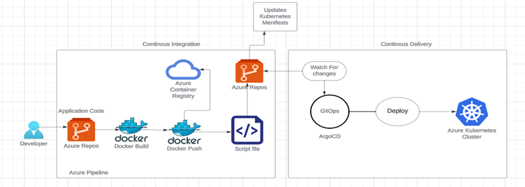

# 🩸 Cloud-Based Blood Donation Management System
### *An Applied Research Project for Saskatchewan Polytechnic & Canadian Blood Services*

---

## 📖 Project Overview
This project addresses critical gaps in the blood donation ecosystem by providing a high-tech, scalable solution for **Canadian Blood Services (CBS)**. By leveraging Cloud Architecture and DevOps automation, the platform streamlines the connection between urgent seekers and eligible donors.

> **Research Focus:** Resolving flaws in blood donation logistics through emerging technologies and cloud-based architecture to give meaning to collected donor data.

## ✨ Key Features
- **📍 Real-time Donor Mapping:** Allows users to search for available donors based on blood groups with a live map interface.
- **🙋‍♂️ Self-Serve Donor Portal:** Donors can register, express interest, and select preferred donation time windows.
- **📊 Strategic Campaign Planning:** Tools for CBS to identify high-concentration areas of potential donors to optimize the location of mobile clinics.
- **⚡ Automated CI/CD:** Built with a robust DevOps pipeline to ensure seamless updates and reliability.

## 🛠️ Technical Stack
* **Cloud Platform:** AWS / Microsoft Azure
* **Backend:** Python (Django/Flask)
* **Infrastructure:** Docker, Kubernetes, Ansible
* **Data Analytics:** Power BI & Excel for donor data visualization
* **Security:** Vulnerability Assessment & ITIL v4 Incident Management standards

## 📐 Solution Architecture

## ✨ If You want to look at the detailed presentation please clink on link below
<https://docs.google.com/presentation/d/1GvYu1Tla3-OxuF3O7hb0IZQ_z67HAVSg/edit?usp=drive_link&ouid=106378480294396604305&rtpof=true&sd=true>

